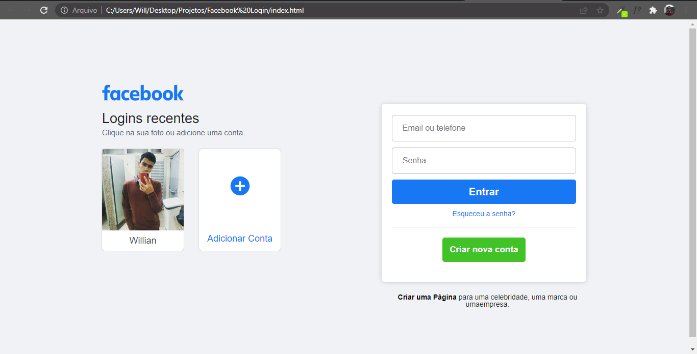

<h1 align="center">
   Facebook login page - Clone
</h1>

<h4 align="center">
  Projeto criado com o intuito de aprimorar meus conhecimentos nas tecnologias HTML e CSS.
</h4>

## 📚 Seções
O projeto é composto por uma  unica pagina contendo um formulario de login.

---

## 💼 Tecnologias utilizadas
Para o desenvolvimento deste projeto utilizei as seguintes tecnologias:

- HTML;
- CSS;

---

#### Autor
Willian Stephano